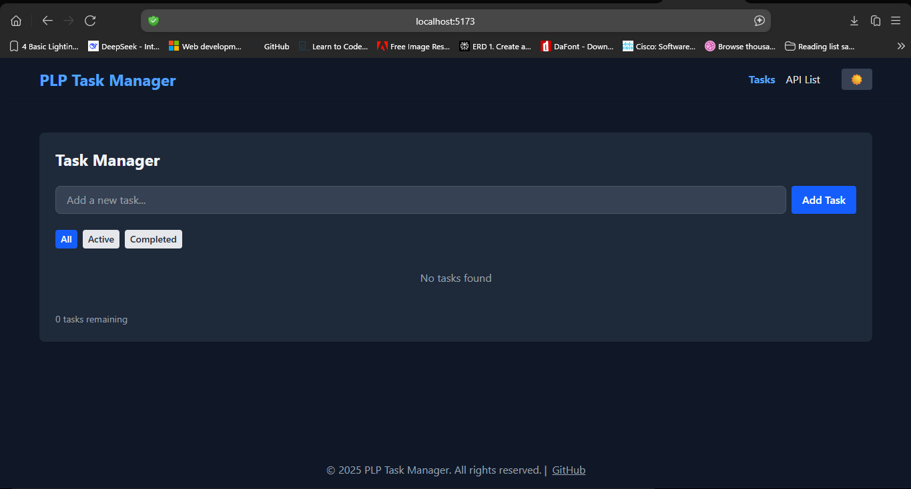
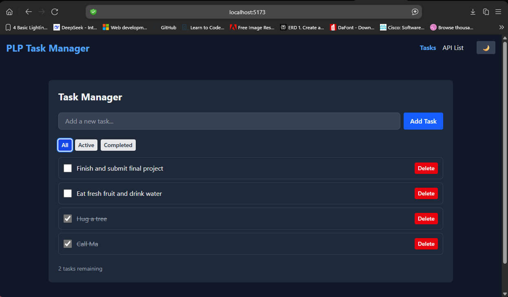

# 🎨 React Task Manager & API Explorer

A responsive React application built with Vite and Tailwind CSS, demonstrating component architecture, state management, hooks, and API integration.

## 🚀 Features
- **Task Manager**: Add, complete, delete, and filter tasks. Tasks persist in localStorage.
- **API Explorer**: Fetches and displays posts from JSONPlaceholder with search, pagination, loading, and error states.
- **Reusable Components**: Button, Card, Navbar, Footer, Layout, and more.
- **Theme Switcher**: Toggle between light and dark mode using Tailwind's dark mode and React Context.
- **Responsive Design**: Works on mobile, tablet, and desktop.
- **Custom Hook**: `useLocalStorage` for persisting tasks.

## 🛠️ Setup Instructions

### Prerequisites
- Node.js v18 or higher
- pnpm (recommended) or npm

### 1. Install dependencies
Using pnpm (recommended):
```sh
pnpm install
```
Or using npm:
```sh
npm install
```

### 2. Start the development server
Using pnpm:
```sh
pnpm run dev
```
Or using npm:
```sh
npm run dev
```

The app will be available at the URL shown in your terminal (e.g., http://localhost:5173/).

### 3. Build for production
```sh
pnpm run build
# or
npm run build
```

### 4. Preview production build
```sh
pnpm run preview
# or
npm run preview
```

## 🖼️ Screenshots
Click below links for application screenshots. 

| Task Manager | API Explorer |
|-------------|-------------|
|  |  |

## 🌐 Deployment
Deploy your app to Vercel, Netlify, or GitHub Pages. Add your deployed URL below:

**Deployed URL:** [https://task-manager-99pn.vercel.app/tasks]

## 📁 Project Structure
```
├── public/                # Static assets
├── src/
│   ├── assets/            # Images and icons
│   ├── components/        # Reusable React components
│   ├── App.jsx            # Main app component
│   ├── main.jsx           # Entry point
│   ├── App.css, index.css # Styles
├── package.json           # Project metadata and scripts
├── vite.config.js         # Vite configuration
├── tailwind.config.js     # Tailwind CSS config (if present)
└── README.md              # This file
```

## 🧩 Technologies Used
- [React](https://react.dev/)
- [Vite](https://vitejs.dev/)
- [Tailwind CSS](https://tailwindcss.com/)
- [React Router](https://reactrouter.com/)
- [JSONPlaceholder API](https://jsonplaceholder.typicode.com/)
- [prop-types](https://www.npmjs.com/package/prop-types)

## ✨ Credits
- Developed by Kebaabetswe Sennelo for Week 3 MERN Assignment
- [Assignment Details](../Week3-Assignment.md)

## 📄 License
This project is for educational purposes.

---


